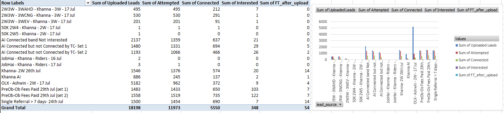
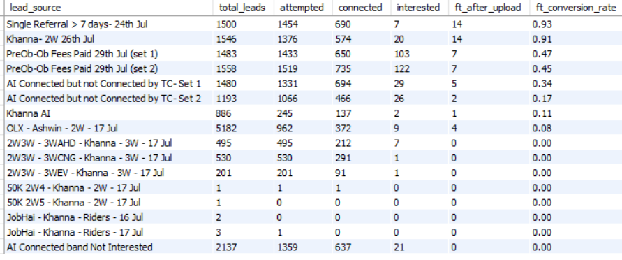

# Vahan Product Analytics Case Study

### Lead Funnel Analysis | SQL | Python | Predictive Analytics

An end-to-end analytics case study analyzing **18,198 leads** to understand lead-to-FT conversion, identify high-performing lead sources, and explore whether early funnel behavior can help predict successful FT outcomes.

---

## Business Objective

The analysis addresses three key business questions:

1. Which lead sources generate the strongest FT conversion?
2. How does lead performance vary across the funnel?
3. Can early lead behavior be used to predict FT after upload?

---

## Question 1: Lead Source and Cohort Analysis

Lead sources were analyzed using Excel pivot tables to compare uploaded leads, attempts, connections, interest, and FT outcomes.

The strongest FT conversion rates were observed for:

| Lead Source | Leads | FT | FT Conversion |
|---|---:|---:|---:|
| Single Referral > 7 days | 1,500 | 14 | **0.93%** |
| Khanna - 2W 26th Jul | 1,546 | 14 | **0.91%** |
| PreOb-Ob Fees Paid (Set 1) | 1,483 | 7 | **0.47%** |
| PreOb-Ob Fees Paid (Set 2) | 1,558 | 7 | **0.45%** |

The dataset contained **54 FT outcomes out of 18,198 leads**, making FT a highly imbalanced outcome.

---

## Question 2: SQL Funnel Analysis

The dataset was loaded into MySQL and aggregated at the lead-source level to analyze the funnel from uploaded leads through FT.

The SQL analysis calculated:

- Total uploaded leads
- Attempted leads
- Connected leads
- Interested leads
- FT outcomes
- FT conversion rate

The SQL results confirmed that **Single Referral > 7 days** and **Khanna - 2W 26th Jul** had the highest FT conversion rates among the analyzed lead sources.

The complete SQL query is available in `q2_aggregation.sql`.

---

## Question 3: Predictive Modeling

A Random Forest classification model was developed to identify factors associated with FT after upload.

Key predictive signals included:

- OB after upload
- Upload-to-first-attempt timing
- Attempt per lead
- Upload day
- Attempted and connected activity
- Lead source

The initial model achieved a **ROC-AUC of 0.993**. A leakage-conscious feature set produced a more conservative **ROC-AUC of 0.688**, highlighting the difficulty of predicting a highly rare FT outcome using only earlier-stage lead information.

Threshold analysis was also performed to evaluate the trade-off between identifying potential FT leads and maintaining precision.

---

## Tools and Techniques

### Python

- Pandas
- NumPy
- Scikit-learn
- Feature engineering
- Train/test splitting
- Random Forest classification
- Classification metrics
- Feature importance
- Threshold analysis

### SQL / MySQL

- Data loading and table creation
- Aggregation using GROUP BY
- Funnel metrics
- Conversion-rate analysis
- Cohort-level analysis

### Excel

- Pivot tables
- Exploratory analysis
- Funnel analysis
- Conversion calculations

---

# Key Takeaway

The analysis indicates that **lead source and early engagement behavior are strongly associated with downstream FT outcomes**.

The results also demonstrate the challenges of modeling extremely rare conversion events, where accuracy alone can be misleading and precision, recall, ROC-AUC, and threshold selection provide more meaningful evaluation.

This case study combines **SQL, Excel, Python, and machine learning** to transform lead-funnel data into actionable product and business insights.

> Raw candidate-level data is not included in this repository.
